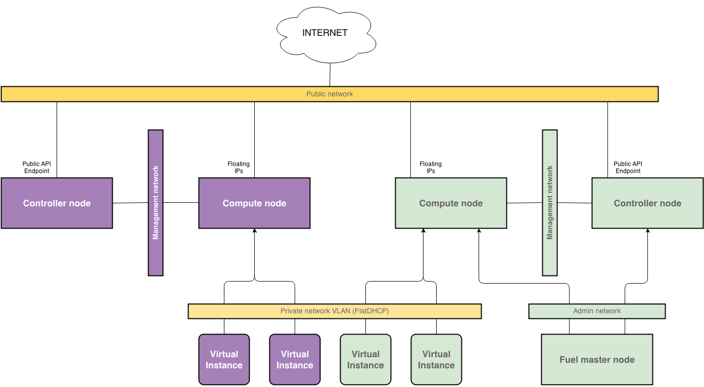

pumphouse
=========

The goal of this project is to provide a tool for migrating workloads (i.e.
tenants and their resources) from arbitrary OpenStack cloud to Mirantis
OpenStack cloud. Source cloud must comply to certain limitations (see below).
Miranits OpenStack cloud should be installed next to existing cloud, using Fuel
automated deployment framework.

## Main workflow

### Acquire initial nodes

Optionally, pumphouse might allow to clean up nodes for Fuel deployment in the
existing cloud. This requires following steps:

- install pumphouse package
- use pumphouse to move virtual instances from certain nodes in existing cloud
  (via evacuate or live migrate or rebuild)
- move released bare metal nodes to isolated L2 network (VLAN) which will serve
  as Admin network from the standpoint of Fuel framework

### Install Fuel master node

We install Fuel master node on one of the nodes reserved for Mirantis OpenStack.
Mirantis OpenStack must be configured so it shares Private and Public L2 networks
with the existing OpenStack cluster.

In this diagram, components of source clouds are in purple, components of
Mirantis OpenStack cloud are in green, and shared Private and Public networks
are golden.

### Workload moving cycle

Moving workloads from source cloud to Mirantis OpenStack cloud is a sequence of
moves of the individual resources executed in cycle. Operator must be able to
select workload resources they want to move. Resource might be as granular as
single VM, or it might be a whole tenant.

To move stateless resource, one must move the virtual system image between
Glance services of clouds. Then VM on the source side must be stopped, metadata
from it (inlcuding IP addresses) must be copied to destination Mirantis
OpenStack cloud, and new VM must be instantiated from corresponding image.

This process should be repeated for all workloads that are being moved to
Mirantis OpenStack cloud.

### Transfer Compute nodes

Once all virtual instances from a compute node are moved to Mirantis OpenStack
cloud, that compute node should be decomissioned from source cloud and
re-installed as compute node in Mirantis OpenStack cluster.

Following steps should be performed:

- disable the compute node in source OpenStack cloud
- shutdown the node using IPMI interface
- move node's port to Admin VLAN of Mirantis OpenStack
- power up the node using IPMI interface
- boot the node from Fuel master node via PXE
- assign Compute role to the node via Fuel API
- deploy the node as Compute node in Mirantis OpenStack cluster via Fuel

### Decomission source cloud

If the ultimate goal of the migration process is to completely replace existing
OpenStack infrastructure with Mirantis OpenStack, then as a final step of the
move controllers of the source cloud should be decomissioned and added to
Mirantis OpenStack cluster.

Steps for decomissioning the controller node are generally the same as steps to
move compute node from source to destination cluster.

## Resources

Pumphouse migrates certain cloud resources managed by corresponding services of
OpenStack.

Service | List of resources
--- | ---
Nova | - instances
     | - keypairs
     | - security groups
     | - quotas
     | - fixed ips
     | - floating ips
Glance | - image files
       | - quotas
Keystone | - tenants
         | - users
         | - roles
         | - user-roles assignments

#### Dependencies

There are dependencies between different resources in terms of migration. For
example, to migrate instances from a particular tenant, the corresponding tenant
must be created first in the destination cloud. See below for the list of
dependencies per resource type.

#### Migration strategy

There could be different migration strategies for different types of resources.
For example, it could be reasonable to migrate all tenants from the source
cloud, or only tenants that have resources. Instances could be migrated on
per-tenant, per-host or per-application basis, or any others. See below for the
list of currently supported strategies.

#### Migration path

Different types of resources require different approach to the migration
process. This section describes the algorithm for every type of resource.

## Keystone

### Tenants

#### Dependencies

Tenants don't have dependency on any other resource type to be moved to
destination cloud.

#### Migration strategy

Three strategies allowed for migrating tenants:

- *all* to move all tenants created in source cloud in a single batch
- *used* to move only those tenants that have resources belonging to them (i.e.
  users, instances or images)
- *specific* to move only tenant(s) specified by name or ID

#### Migration path

Tenants are moved via calls to Identity API. Metadata read from source cloud API
and uploaded to destination cloud API.

### Users

#### Dependencies

For migrating users from source cloud, destination cloud must have the same set
of tenants available. So the list of dependencies is as follows:

- tenants

#### Migration strategy

Following strategies are supported for migrating users:

- *all* moves all users from all tenants available in the source cloud, given 
  the dependencies are satisfied
- *tenant* moves all users from the given tenant in the source cloud
- *specific* moves users specified by name or ID

# Migration path

Users are moved via calls to Identity API. The only exception to this process
is the Password attribute: it must be copied over directly between state 
databases of source and destination clouds.

### Roles

#### Dependencies

Role resource does not depend on resources of any other type being defined in
the target cloud.

#### Migration strategy

Following strategies are supported for migrating roles:

- *all* moves all role definitions from source to destination cloud

#### Migration path

Roles are moved via calls to Identity API.

### User-role assignments

#### Dependencies

User-role assignments depend on the following resources:

- tenants
- users

Note that mapping between resource IDs in source and destination clouds must be
preserved for assignments to be correct.

#### Migration strategy

User-role assignments are moved via calls to Identity API.
